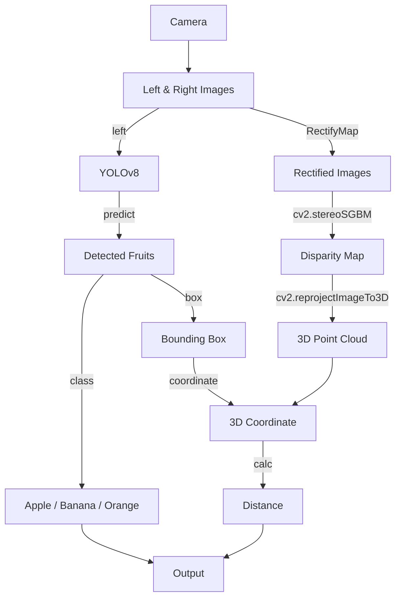

# Group Assignment: Fruit Detection and Distance Measurement using OpenCV

## Installation

### Requirements
```shell
pip install "opencv-contrib-python>=4.10.0.84" "ultralytics==8.2.103"
```

### Dataset

Download the original dataset from [here](https://www.kaggle.com/mbkinaci/fruit-images-for-object-detection) and extract it to the `origin` directory.

## Architecture

```
project
├─fruit3
│  └─train
│     └─weights
├─origin
│  ├─test
│  │  ├─apple_77.jpg
│  │  ├─apple_78.jpg
│  │  └─...
│  └─train
│     ├─apple_1.jpg
│     ├─apple_2.jpg
│     └─...
├─yolo_datasets (generated by `dataset_gen.py`)
│  ├─images
│  │  ├─test
│  │  │  ├─0.jpg
│  │  │  ├─1.jpg
│  │  │  └─...
│  │  ├─train
│  │  │  ├─0.jpg
│  │  │  ├─1.jpg
│  │  └─val
│  │     ├─0.jpg
│  │     ├─1.jpg
│  │     └─...
│  ├─labels
│  │  ├─test
│  │  │  ├─0.txt
│  │  │  ├─1.txt
│  │  │  └─...
│  │  ├─train
│  │  │  ├─0.txt
│  │  │  ├─1.txt
│  │  └─val
│  │     ├─0.txt
│  │     ├─1.txt
│  │     └─...
│  └─fruit.yaml
├─dataset_gen.py
├─double_camera.py
├─fruit3.pt (generated by `train.py`)
├─main.py
├─README.md
└─train.py
```

### Program Flow



## Demo

View the demo video [here](https://youtu.be/uN0OsokF0LQ).
